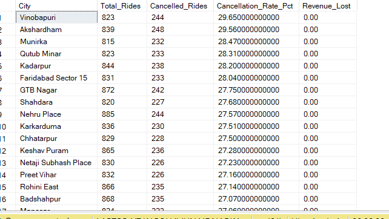
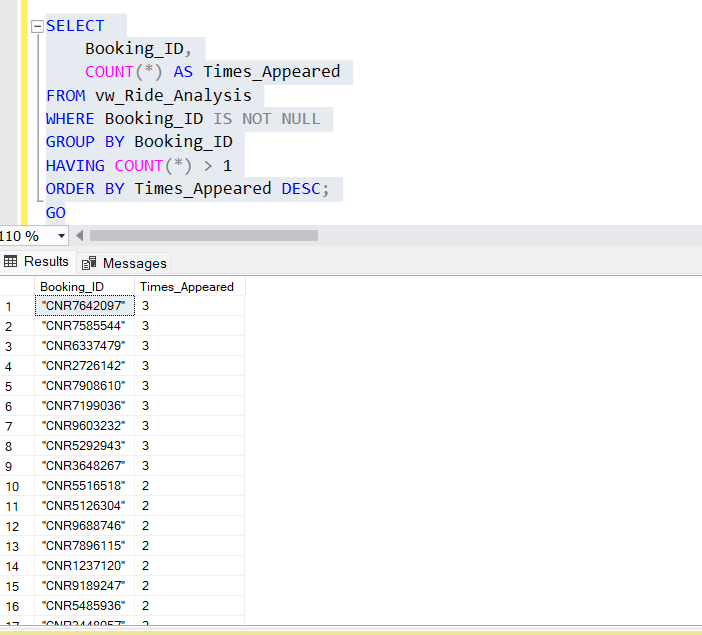
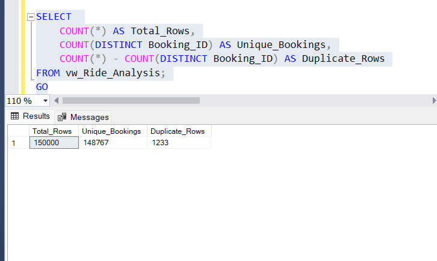
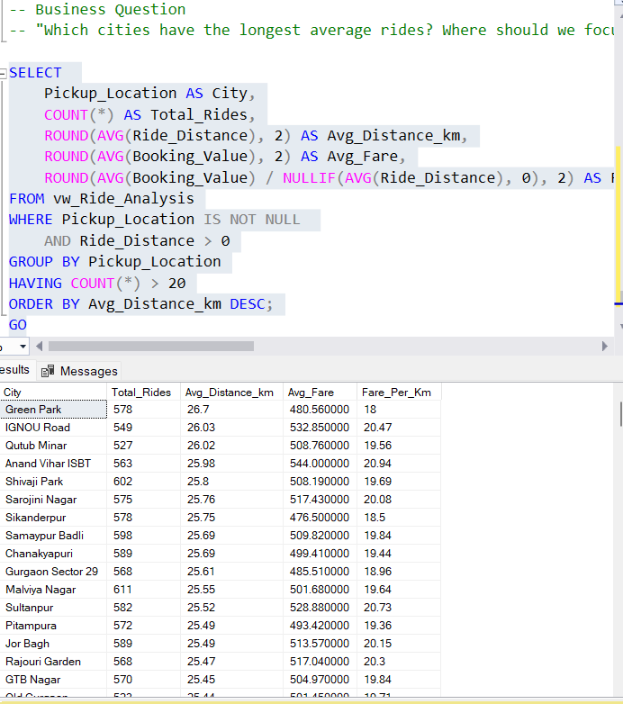
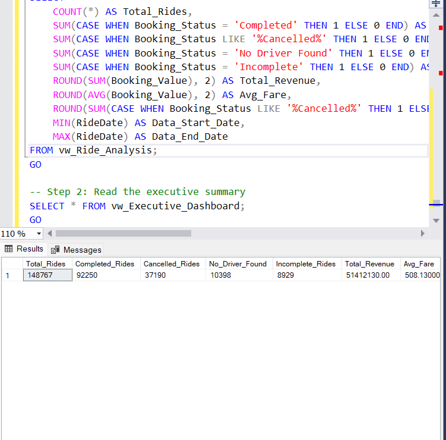

# 🚕 Uber Ride Operations Analysis (SQL)

End-to-end SQL analysis of 148,767 Uber rides to uncover 
cancellation patterns, revenue leakage, driver recruitment needs, 
and payment behavior — using only MS SQL Server.

---

## 📌 Project Overview

**Goal:** Turn a messy 150K-row ride dataset into actionable business insights using SQL.

**Tools:** MS SQL Server (SSMS), BULK INSERT, Views, CASE, Window Functions

**Skills Demonstrated:** Data cleaning, ETL, aggregations, business analysis, query optimization

---

## 🚀 How to Run This Project

1. Clone the repository:
   ```bash
   git clone https://github.com/Junaid-Narkar/Uber-SQL-Analysis.git

2. C:\Program Files\Microsoft SQL Server\MSSQL16.JunaidNarkar11\MSSQL\DATA\

3. Open Uber Analysis by Junaid Narkar.sql in SSMS.

4. Update the file path in the BULK INSERT statement to match your local path.

5. Run the entire script top-to-bottom — it will:

    A) Create the database and table

    B) Load the CSV

    C) Clean and convert data types

6. Run all 10 business queries

7. Read through the query outputs and README for insights.

## 📂 Dataset

- **Source:** `ncr_ride_bookings.csv` (~24 MB)
- **Rows:** 148,767 (after deduplication)
- **Columns:** 21 (date, time, booking status, vehicle type, pickup/drop location, ratings, payment method, etc.)
- **Period:** January 2024 – December 2024

---

## 🧹 Data Cleaning (ETL)

Raw CSV had several issues that required cleaning:

1. **All columns imported as `nvarchar(50)`** to avoid type conversion errors
2. **Replaced `'null'` text with real `NULL`** using `LTRIM(RTRIM(...))` + `IN (...)`
3. **Converted data types** with `ALTER COLUMN`:
   - `Booking_Value` → `DECIMAL(18,2)`
   - `Ride_Distance`, `Driver_Ratings`, `Customer_Rating` → `FLOAT`
   - `Cancelled_Rides_by_Customer/Driver`, `Incomplete_Rides` → `INT`
   - `Date` → `DATE`, `Time` → `TIME`
4. **Added primary key** `id INT IDENTITY(1,1)`
5. **Removed 1,233 duplicate Booking_IDs** using `ROW_NUMBER()` + CTE

---

## 📊 The 10 Business Queries

| # | Query | Business Question | Key Finding |
|---|-------|-------------------|-------------|
| 1 | Top 3 Cities for Driver Recruitment | Where do we need more drivers? | Vinobapuri, Akshardham, Qutub Minar top the list |
| 2 | Revenue Leakage Detection | Where are we losing money? | Completed-but-no-payment rides flagged as CRITICAL |
| 3 | Cancellation Rate by City | Which cities cancel the most? | 27-30% cancellation across all cities |
| 4 | Cancellation by Time of Day | When do cancellations peak? | Night (10 PM-5 AM) worst at 25.30% |
| 5 | Cancellation by Vehicle Type | Which vehicle is unreliable? | All vehicles ~25% cancellation (uniform) |
| 6 | Seasonal Fare Variations | Do fares change monthly? | March highest (₹526.65 avg), May/Aug lowest |
| 7 | Avg Distance by City | Where are the longest rides? | Green Park (26.70 km avg) |
| 8 | Driver Performance View | Who are our top drivers? | 4.3 rating is most common (13,996 rides) |
| 9 | Payment Method Analysis | How do customers pay? | UPI dominates (45%), ₹23.16 Cr revenue |
| 10 | Executive Summary | What's the big picture? | See below |

---

## 🎯 Executive Summary

| Metric | Value |
|--------|-------|
| Total Rides | 148,767 |
| Completed Rides | 92,250 (62%) |
| Cancelled Rides | 37,190 (25%) |
| No Driver Found | 10,398 (7%) |
| Incomplete Rides | 8,929 (6%) |
| Total Revenue | ₹51.4 Cr (~₹514M) |
| Average Fare | ₹508.13 |
| Cancellation Rate | 25% |

---

## 📸 Query Outputs

### Q1: Top 3 Cities for Driver Recruitment


### Q3: Cancellation Rate by City


### Q4: Cancellation by Time of Day


### Q9: Payment Method Analysis


### Q10: Executive Summary


## 💡 Key Business Insights

1. **1 in 4 rides is cancelled** — biggest operational issue
2. **Night shift has highest cancellations** (25.30%) — driver shortage
3. **UPI is the dominant payment** (45% of rides) — protect this channel
4. **Evening generates most revenue** (₹16.3 Cr) — peak hours
5. **All vehicle types behave similarly** (~25% cancel) — no specific problem vehicle
6. **Fares are stable year-round** — no strong seasonality
7. **Auto is the highest volume vehicle** (37,110 rides, ₹12.77 Cr)

---

## 🚀 Recommendations

| Recommendation | Action |
|----------------|--------|
| Increase Driver Recruitment | Target top 3 high-cancellation cities with sign-on bonuses |
| Reduce Night Cancellations | Offer night-shift incentives (10 PM – 5 AM) |
| Promote Uber Wallet | Currently underused at 12% — push with discounts |
| Protect UPI Gateway | 45% of volume — priority for engineering |
| Investigate Revenue Leakage | Manual review of "Completed but No Payment" rides |

---

## 🛠 SQL Skills Demonstrated

- **Data Cleaning:** `UPDATE`, `LTRIM/RTRIM`, `IN`, `NULLIF`
- **ETL:** `BULK INSERT`, `ALTER COLUMN`, `CREATE TABLE`
- **Aggregations:** `COUNT`, `SUM`, `AVG`, `ROUND`
- **Conditionals:** `CASE WHEN ... THEN ... END`
- **Grouping:** `GROUP BY`, `HAVING`
- **Date/Time:** `DATEPART`, `DATENAME`, `BETWEEN`
- **Window Functions:** `ROW_NUMBER() OVER (PARTITION BY ...)`
- **Subqueries:** `(SELECT COUNT(*) FROM ...)`
- **Views:** `CREATE VIEW` for reusable reporting
- **Duplicates:** CTE + `ROW_NUMBER()` to remove duplicates
- **Set Operators:** `UNION ALL`
- **Safe Math:** `NULLIF` to prevent divide-by-zero

---

## 📁 Repository Structure

Uber-SQL-Analysis/
├── Uber Analysis by Junaid Narkar.sql # Full SQL script (all 10 queries)
├── ncr_ride_bookings.csv # Raw dataset
├── README.md # This file
├── .gitignore # Python/Git ignore rules
└── images/
├── q1_top_cities.png 
├── q4_time_cancellation.png 
└── q10_executive_summary.png 


---

## 🔗 Connect

- **LinkedIn:** [Junaid Narkar](https://www.linkedin.com/in/junaid-narkar-b885b83a9/)
- **GitHub:** [Junaid-Narkar](https://github.com/Junaid-Narkar)
- **Email:** junaidnarkar01@gmail.com
- **Location:** Kuwait 🇰🇼

---

## ⭐ If you found this useful, give it a star!
